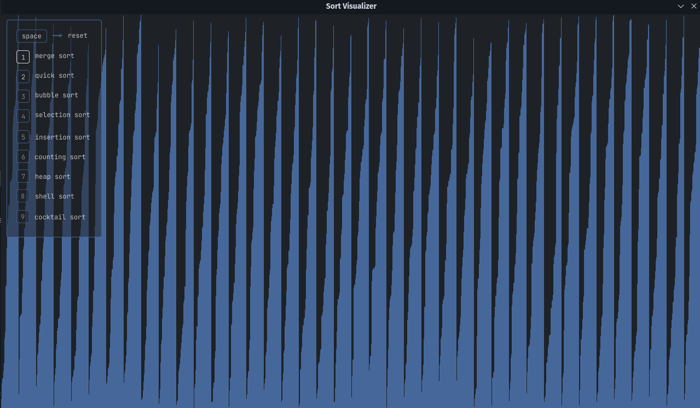
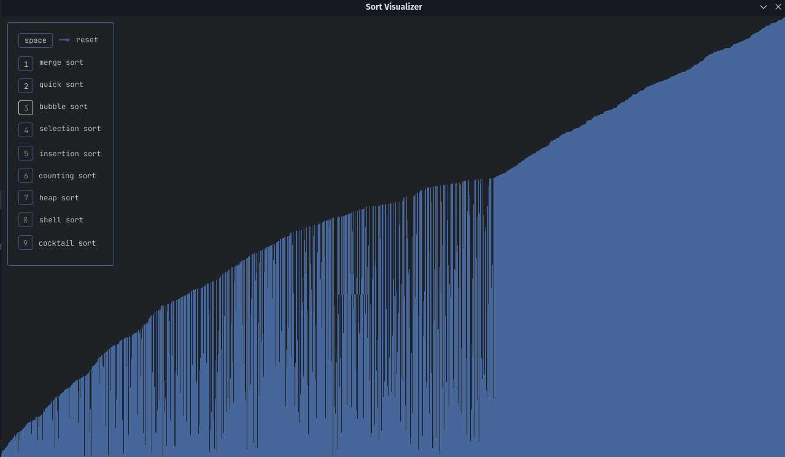
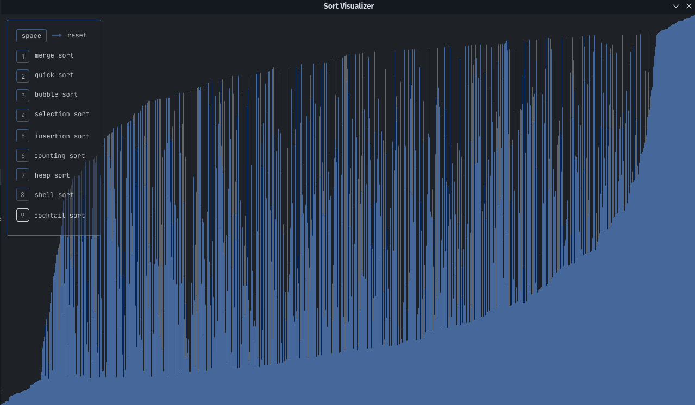
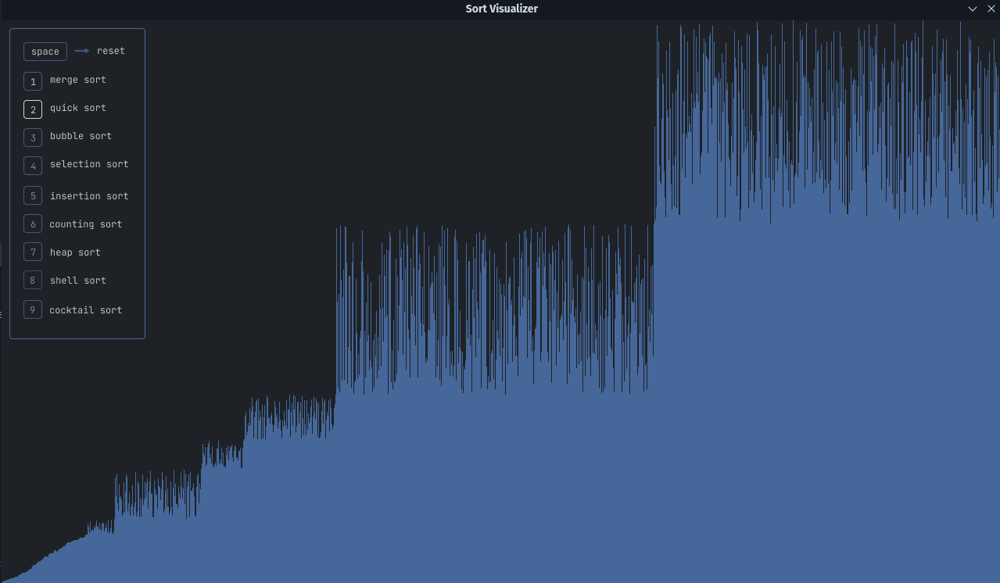

# Sort Visualizer

    O programa Sort Visualizer é um programa escrito em Python e usando a biblioteca Pygame que permite visualizar em tempo real alguns algoritmos de ordenação. Ele permite ao usuário selecionar um algoritmo de ordenação e observar a ordenação de uma lista de números em tempo real.

# Algumas imagens

## Merge Sort



## Bubble Sort



## Cocktail Sort



## Quick Sort



## Como usar

    Para usar o programa Sort Visualizer, é necessário instalar a biblioteca Pygame. Para instalar o Pygame, execute o seguinte comando no terminal:

```python
pip install pygame
```

Para iniciar o programa, execute o arquivo `main.py`. Uma janela do Pygame será aberta.

O programa tem as seguintes funcionalidades:

- Pressionar as teclas numéricas de 1 a 9 para selecionar o algoritmo de ordenação correspondente.
- Pressionar a tecla `Space` para reiniciar o processo de ordenação com uma nova lista de números aleatórios.
- Fechar a janela do Pygame para encerrar o programa.

## Algoritmos de ordenação suportados

O programa suporta os seguintes algoritmos de ordenação:

- Merge Sort
- Quick Sort
- Bubble Sort
- Selection Sort
- Insertion Sort
- Counting Sort
- Heap Sort
- Shell Sort
- Cocktail Sort

## Como funciona

    O programa cria uma lista de números aleatórios e, em seguida, usa o algoritmo de ordenação selecionado para ordenar a lista. Durante o processo de ordenação, o programa exibe a lista em tempo real, permitindo que o usuário veja como o algoritmo de ordenação funciona.

## Limitações

    O programa foi desenvolvido para fins educacionais e, portanto, pode ter algumas limitações em termos de desempenho e escalabilidade para lidar com listas muito grandes. Além disso, o programa pode ter algumas limitações em termos de precisão visual do processo de ordenação, dependendo do tamanho da janela do Pygame e da resolução do monitor.